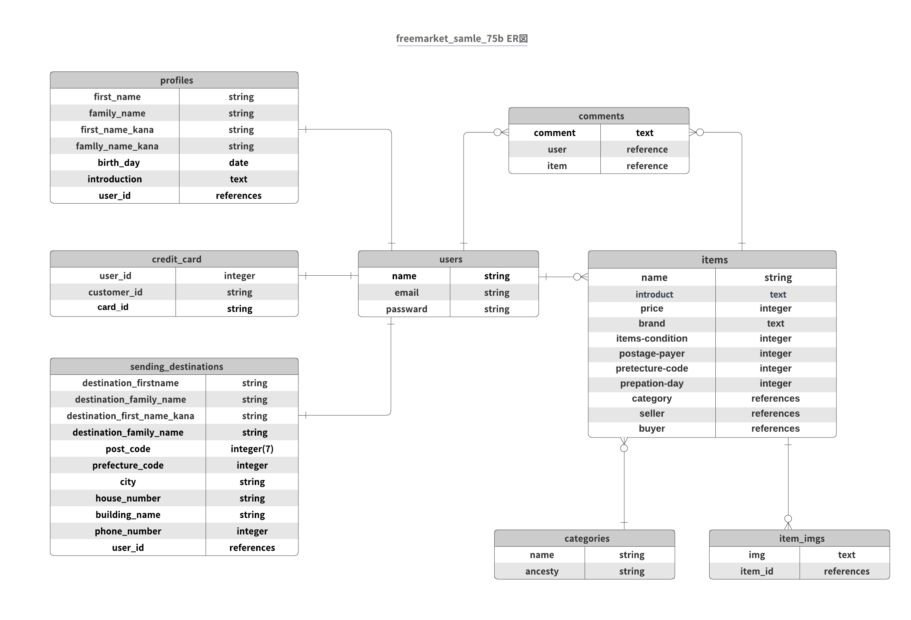

# README

<h1 align="center">フリーマーケットサイト</h1>

- メルカリクローンのフリーマーケットサイトです。
- TECH::EXPERT 75期短期集中コースBチームで作成。
- 作成期間 2020/5/19 ~ 2020/6/12
- 

## :paperclip: 主な使用言語
 <!-- rubyのロゴ -->
 <!-- RubyOnRailsのロゴ -->
 <!-- Hamlのロゴ -->
<a><</a> <!-- Scssのロゴ -->
 <!-- jQueryのロゴ -->
 <!-- AWSのロゴ -->

## 機能紹介
- 新規会員登録・ログインをすると商品の購入、出品ができます。
- 新規会員登録、ログインがお済みでない方も商品の一覧、詳細を閲覧可能です。
- 決済方法はご自身のクレジットカードを登録して購入できます。

## サイトURL紹介
- ユーザー名:admin
- パスワード:password
- IPアドレス:54.178.226.20

## :globe_with_meridians: インストール方法
1.このリポジトリを複製 
`$ git clone https://github.com/kanami77764/freemarket_samle_75b.git`

2.インストールしたリポジトリに移動 
`$ cd freemarket_samle_75b.git`

3.gemをアプリケーションに適用 
`$ bundle install` 

4.DBの作成&反映 
`$ rails db:create` 
`$ rails db:migrate` 

5.アプリケーションの起動 
`$ rails s` 
:point_right:`http://localhost:3000`

# :page_facing_up: DB設計

## ER図

## usersテーブル
|Column|Type|Options|
|------|----|-------|
|name|string|null: false|
|password|string|null: false|
|email|string|null:false, unique:true|
### Association
- has_many :items, dependent: :destroy
- has_many :comments, dependent: :destroy
- has_many :favorites, dependent: :destroy
- has_one :profile, dependent: :destroy
- has_one :sns_authentication, dependent: :destroy
- has_one :sending_destination, dependent: :destroy
- has_one :credit_card, dependent: :destroy

## profiles テーブル
|Column|Type|Options|
|------|----|-------|
|first_name|string|null:false|
|family_name|string|null:false|
|first_name_kana|string|null:false|
|family_name_kana|string|null:false|
|birth_day|date|null:false|
|introduction|text||
|user|references|null:false,foreign_key:true|
### Association
- belongs_to :user

<!-- ## sns_authenticationsテーブル
|Column|Type|Options|
|------|----|-------|
|provider|string|null: false|
|uid|string|null:false,unique:true|
|user|references|null: false,foreign_key:true|
### Association
- beolongs_to :user -->

## sending_destinationsテーブル
|Column|Type|Options|
|------|----|-------|
|destination_first_name|string|null:false|
|destination_family_name|string|null:false|
|destination_first_name_kana|string|null: false unless value.to_s =~/^[^ -~｡-ﾟ]*$/|
|destination_family_name_kana|string|null: false unless value.to_s =~/^[^ -~｡-ﾟ]*$/|
|post_code|integer(7)|null:false|
|prefecture_code|integer|null:false|
|city|string|null:false|
|house_number|string|null:false|
|building_name|string||
|phone_number|integer|unique:true|
|user|references|null: false,foreign_key:true|
### Association
- belongs_to: user

## credit_cardsテーブル
|Column|Type|Options|
|------|----|-------|
|user_id|integer|null:false|
|customer_id|string|null:false|
|card_id|string|null:false|
### Association
- belongs_to: user

## itemsテーブル
|Column|Type|Options|
|------|----|-------|
|name|string|null:false,validates :introduction,length:{maximum:40}|
|introduction|text|null:false,validates :introduction,length:{maximum:1000}|
|price|integer|null:false|
|brand|text|null:false|
|item_condition|integer|null:false,foreign_key:true|
|postage_payer|integer|null:false,foreign_key: true|
|prefecture_code|integer|null:false|
|preparation_day|integer|null:false,foreign_key: true|
|category|references|null:false,foreign_key:true|
|seller|references|null:false,foreign_key:true|
|buyer|references|foreign_key:true|
### Association
- has_many :comments, dependent: :destroy
- has_many :favorites, dependent: :destroy
- has_many :item_imgs, dependent: :destroy
- belongs_to :category
- belongs_to :user

## item_imgsテーブル
|Column|Type|Options|
|------|----|-------|
|url|string|null:false|
|item|references|null:false,foreign_key:true|
### Association
- belongs_to :item

<!-- ## favoritesテーブル
|Column|Type|Options|
|------|----|-------|
|user|references|null:false,foreign_key:true|
|item|references|null:false,foreign_key:true|
### Association
- belongs_to :user
- belongs_to :item -->

<!--## commentsテーブル
|Column|Type|Options|
|------|----|-------|
|comment|text|null:false|
|user|references|null:false,foreign_key:true|
|item|references|null:false,foreign_key:true|
### Association
- belongs_to :user
- belongs_to :item -->

## categoriesテーブル
|Column|Type|Options|
|------|----|-------|
|name|string|null:false|
|ancestry|string|null:false|
### Association
- has_many :items
